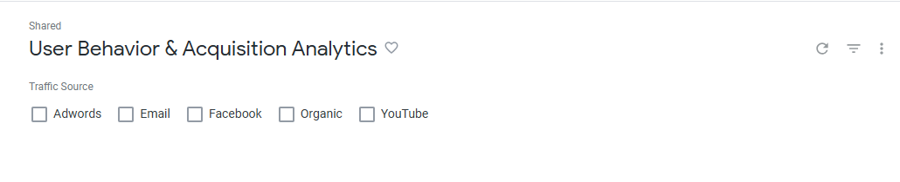
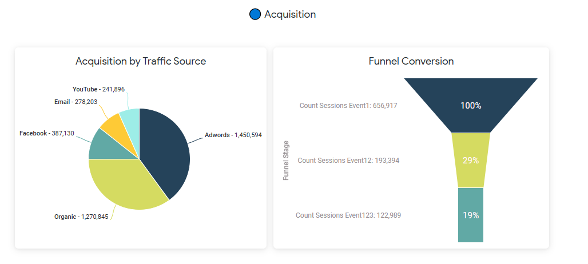
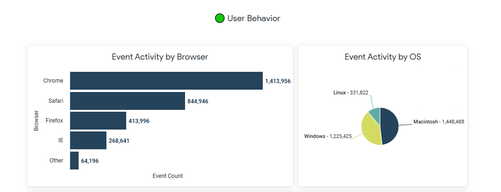
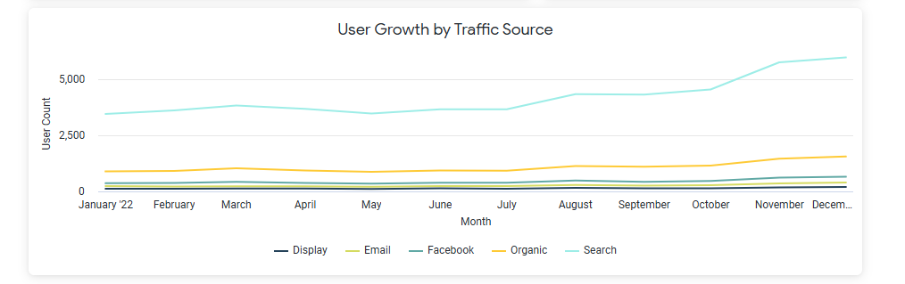
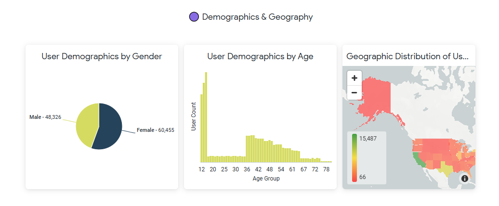

# User Behavior & Acquisition Analytics - Looker Dashboard

**Built a 3-section interactive Looker dashboard analyzing user 
acquisition, funnel conversion, platform behavior, and demographics 
using Google Cloud's Looker.**

## Overview

Which channels bring the most users? Where do they drop off? 
Who are they and where are they based?

This project builds an interactive analytics dashboard in Looker 
using a simulated ecommerce dataset to answer the kinds of questions 
a SaaS analytics team deals with daily. The focus is deliberately on 
user behavior and acquisition rather than transactions because 
understanding how users arrive and engage is where most SaaS growth 
levers actually sit.

## Tools & Technologies

- Google Looker - Explores, Looks, dashboard construction, filters, 
  pivot, funnel visualization, geographic mapping
- Built using Google Cloud's Looker lab environment with a 
  pre-configured ecommerce Explore

## Business Questions

- Which acquisition channels drive the most user activity?
- Where do users drop off in the session funnel and by how much?
- Which browsers and operating systems dominate the user base?
- How has user growth trended over time across different channels?
- What does the demographic profile of the user base look like?
- Which US states have the highest user concentration?

## Dashboard

### Dashboard Overview

The full dashboard includes a Traffic Source filter at the top that 
updates all tiles simultaneously, allowing channel-by-channel 
comparison across all three sections in a single click.

---

### Acquisition

**Acquisition by Traffic Source** — Adwords leads with 1,450,594 
events, followed by Organic at 1,270,845. Facebook sits at 387,130 
while Email and YouTube trail at 278,203 and 241,896 respectively. 
The gap between Adwords/Organic and the remaining channels suggests 
paid search and organic discovery are the primary growth drivers.

**Funnel Conversion** — Of the 656,917 sessions that reached Event 1, 
only 193,394 (29%) progressed to Event 2 and 122,989 (19%) completed 
all three stages. A 71% drop at the first funnel transition is the 
single biggest opportunity for product and onboarding improvement.

---

### User Behavior

**Event Activity by Browser** — Chrome dominates with 1,413,956 
events. Safari follows at 844,946, with Firefox at 413,996, IE at 
268,641, and Other at 64,196. Chrome and Safari together account 
for the vast majority of activity, making them the priority for 
any frontend optimization effort.

**Event Activity by OS** — Macintosh leads at 1,448,488 events 
with Windows close behind at 1,225,425. Linux is a distant third 
at 331,822. The near-even Mac/Windows split suggests a broad user 
base rather than a niche technical audience.

---

### User Growth

**User Growth by Traffic Source** — Search consistently drives 
the highest user volume across the period with a clear upward 
trend. All other channels — Display, Email, Facebook, and Organic 
remain relatively flat throughout, raising the question of 
whether investment in those channels is proportionate to the 
returns they generate.

---

### Demographics & Geography

**Gender Split** — Female users (60,455) outnumber male users 
(48,326), a roughly 56/44 split. For a SaaS product this is a 
meaningful signal for how marketing messaging and product UX 
should be calibrated.

**Age Distribution** — The user base skews heavily toward younger 
users with a sharp drop-off after the early twenties. This 
concentration has implications for pricing strategy, feature 
prioritization, and long-term retention planning.

**Geographic Distribution** — State-level user counts range from 
66 to 15,487, indicating significant geographic concentration. 
States at the lower end of that range represent potential 
expansion opportunity.

## Key Findings

**Funnel drop-off is the most critical issue this dashboard 
surfaces.** Only 19% of users who enter the funnel complete all 
three stages. Understanding what happens between Event 1 and 
Event 2 whether it is a UX barrier, a value gap, or an 
onboarding failure would be the highest-priority question for 
the product team.

**Adwords and Organic are carrying acquisition.** Together they 
account for over 2.7 million events while the remaining three 
channels combined sit under 1 million. In a real SaaS context 
this would prompt a channel reallocation conversation.

**Female users outnumber male users by a meaningful margin.** 
Combined with the younger age skew, this demographic profile 
has direct implications for product positioning, messaging 
tone, and feature prioritization.

## Dashboard Interactivity

The dashboard includes a Traffic Source filter that updates all 
tiles simultaneously, allowing channel-by-channel comparison of 
funnel performance, user growth, browser behavior, and geographic 
distribution in a single click.
